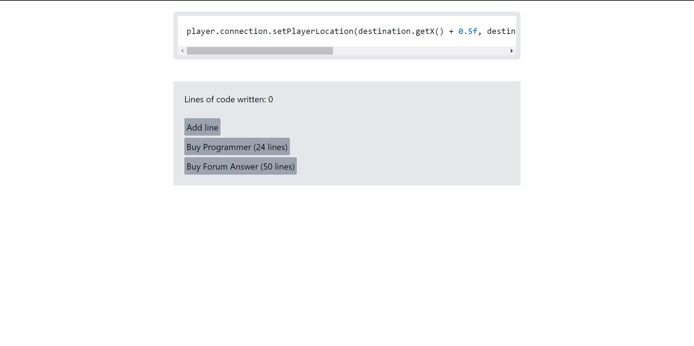

# Exercise: `scrip.ts`
- Exercise directory: `/exercises/idle-game`
- Sample answer: `/exercise-solutions/idle-game`

With the power of `useState` and `useEffect`, we are going to make a small **idle game**.

An **idle game** (also known as an **incremental game**) is a game that slowly gets the
player to gain resources automatically - and thus, "idle" from the game and make progress.
Some examples of idle games are:
- [**Cookie Clicker**](https://orteil.dashnet.org/cookieclicker/) - perhaps the most famous
idle game of them all, players click cookies to buy grandmas to bake cookies, farms to dig
cookies out of the ground... all to get as many cookies as humanly possible.
- [**A Dark Room**](https://adarkroom.doublespeakgames.com/) - a minimal, text-based take on
the genre, where you slowly gain resources to advance further and further along an
overarching story.
- [**Clicker Heroes**](https://www.clickerheroes.com/) - increase your damage per second and
defeat stronger and stronger monsters.
- [**Asbury Pines**](https://store.steampowered.com/app/2212790/Asbury_Pines/) - a murder
mystery that uses the mechanics of idle games.

If you want to find more interesting games in the genre, have a look at [r/incremental_games](https://www.reddit.com/r/incremental_games/).

## Premise

You are a software engineer, who has been tasked to write thousands... nay,
*millions* of lines of code for the company's next big thing™️. Easier said than
done... the end is nowhere in sight. However, ever the optimiser, you decide to
code up some tools that can help you get closer and closer to your goal. Do
you have what it takes to be the next tech superstar?

This is... `scrip.ts`.

## Setting up

Before running the app, make sure you have NPM installed (preferably the latest
version).

To run the app itself, run `npm run dev`. Your game looks something like this: 

## Tasks

You will need to implement all of your functionality in the functional component
`App`. At the end of all of these exercises, your finished SPA should look something
like this: 

See the game in action [here](images/game.mp4).

> This exercise uses **TypeScript** instead of JavaScript. You do not need to worry
> too much about types - most of the code to do with types has already been set up
> for you. If any task does need TypeScript-specific syntax, it will be highlighted
> for you.

### Task 1: Counting lines

Let's first begin by implementing the line counter and the "Add lines" button.

Use `useState` to keep track of the number of lines we've gained, and wire that up to
the button such that every time we click the button, the number of lines increments.

### Task 2: Making it prettier

Having just a number go up when we click the button is good and all, but we want
some more interactivity! Now's the perfect time to introduce `useEffect`, and
implement the code block at the very top.

Some pieces of the puzzle have been implemented for you:
- The `Highlight` component in `components/Highlight.tsx` takes in two fields -
  `contents` (the line of code itself) and `language` (the programming language
  the line of code is in).
- The `Line` type in `types.ts` contains those two fields. Think about TypeScript
  types like JavaScript objects, except your code editor raises an error if you
  put the wrong fields in.
- Lastly, `getRandomLine` is an async function that fetches a random line from
  files in the `public` folder, and returns a `Line` object.

It is now your job to link it all up.

### Task 3: The idle game

We've got a button that makes a number go up, but we're missing the "idle" part
of our idle game. Now we need a way for our player to buy items that can "click"
our button for us, and a loop that increments the total lines of code based on
the items we have.

A `Resource` type has been provided for you in `types.ts`, with the following
structure:

```ts
export type Resource = {
  // The name of the item we want to buy
  name: string,
  // How much it increases our lines per second (LPS) by
  increase: number,
  // The number of this type of item we have
  amount: number,
  // How much it costs
  cost: number,
};
```

In the sample solution, we have the following two resources:
- The *programmer* produces 0.1 lines of code per second, and costs 20 lines.
- The *forum answer* produces 0.3 lines of code per second, and costs 50 lines.

After each purchase, the price of an item will go up by 10%.

You will need to keep track of each resource the player has (through `useState`),
and set up a loop to increment the number of lines by the correct amount every second
(through `useEffect`).

> You may notice that floating-point arithmetic messes up the game by a fair bit -
> a *bonus challenge* would be to still increment the number of lines by the correct
> amount every second (which could be a decimal amount), but only display an integer
> number of lines, and only update the code block when a *whole* number of lines
> changes.
>
> You may find the type `LineState` can come in handy.
